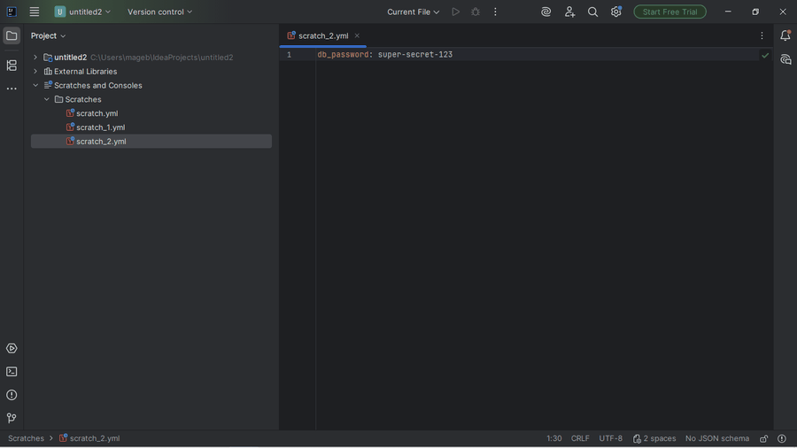

# Ansible Companion

IntelliJ/PyCharm plugin. **Encrypt and decrypt Ansible Vault (1.1/AES256
format) directly in the editor**, without depending on `ansible-vault`
being installed.

## Why it exists

Born from real evidence in JetBrains Marketplace reviews, not assumptions:
this niche's incumbents (paid and free) have concrete, repeated complaints
about price, YAML they shouldn't touch, and badly parsed Jinja2. Vault
encrypt/decrypt in particular is one of the features users value most in
the paid incumbent — and one of the few pieces that can be built without
depending on an external language server.

## Why reimplemented, not the `ansible-vault` CLI

Ansible **does not run on native Windows** (`ansible-core` fails to import
`fcntl`/`os.get_blocking`, both POSIX-only) — and a good share of this
plugin's real users are on Windows precisely because that's why they need
IntelliJ/PyCharm to edit Ansible in the first place, not a Linux VM with
vim. Asking them to install `ansible-vault` as a prerequisite isn't a way
out.

`AnsibleVaultCipher` reimplements the 1.1/AES256 format with the JDK's own
`javax.crypto` — zero new dependencies. Verified against the real test
vector from `ansible/ansible`'s own test suite
(`test/units/parsing/vault/test_vault.py`) and against a real platform test
(`BasePlatformTestCase`) that confirms the encrypt→decrypt round-trip on a
real editor.

## Usage



Select text in the editor → right-click:
- **Encrypt Selection as Ansible Vault** — asks for a password, replaces
  the selection with a `$ANSIBLE_VAULT;1.1;AES256` block.
- **Decrypt Ansible Vault Selection** — on an already-encrypted block, asks
  for the password and replaces it with the plain text.

The password is never saved or cached between uses.

## What's next (`future/v0.2-ansible-lsp/`)

FQCN-aware completion (`ansible.builtin.*`), correct Jinja2 parsing inside
YAML, and file-type detection that doesn't hijack Kubernetes/Helm/
Docker-compose YAML — built and tested, but held out of this release. The
Node-runtime bundling blocker (downloading and caching a checksum-verified
Node binary per user, so end users never need Node installed themselves)
is now solved — see `future/v0.2-ansible-lsp/README.md`. What's still
pending: bundling the language server's own JS files into the plugin's
`.zip`.

Role support and multi-environment variable preview aren't built yet.

## Development

```
./gradlew test           # unit + platform tests
./gradlew buildPlugin     # generates build/distributions/*.zip
./gradlew verifyPlugin    # checks compatibility against real IDEs
```

`runIde` (spins up a full IntelliJ instance) is reserved for occasional
verification, not the everyday loop — to test editor actions, a platform
test (`BasePlatformTestCase`, see
`src/test/kotlin/.../vault/VaultEditorOpsTest.kt`) is faster and doesn't
depend on mouse clicks.

## License

Apache-2.0. See `LICENSE`.
